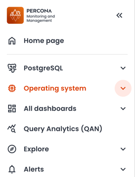

# Percona Monitoring and Management 3.6.0

**Release date**: January 2026

Percona Monitoring and Management (PMM) is an open source database monitoring, management, and observability solution for MySQL, PostgreSQL, MongoDB, Valkey and Redis. PMM empowers you to: 

- monitor the health and performance of your database systems
- identify patterns and trends in database behavior
- diagnose and resolve issues faster with actionable insights
- manage databases across on-premises, cloud, and hybrid environments

## 📋 Release summary

## ✨ Release highlights

### New native PMM navigation and revamped user interface
The first thing you'll notice with this update is the new look-and-feel of the PMM interface. We've moved away from Grafana's built-in menus to PMM's own navigation, organized around PMM's workflows to make it easier for you to move through PMM and find what you need faster. This brings: 

- A new, always-visible sidebar that provides consistent access to all PMM features without relying on Grafana’s native menus: 

    

- Sticky time range and variables: Selected time ranges and dashboard variables now persist when switching between dashboards, so you no longer need to reapply filters.

- A new theme switcher in the sidebar applies Light or Dark mode to both the PMM interface and embedded dashboards.

- Query Analytics now fully supports the light theme

- Centralized Help & Resources: Quick access to documentation, the community forum, support contact, and feedback tools. Admin users also see **Dump** and **Logs** options.

-  New interactive onboarding tour to help first-time users explore PMM’s key features. You can start it from the Help Center’s Welcome Card or from **Useful tips > Start PMM tour**.

- Clearer update reminders: small badges and pop-up messages so you can easily see when updates are available.

#### You should know that: 

- The new navigation is enabled by default, and you will not be able to revert to the previous Grafana-based menus.
- If you use a custom `grafana.ini` file, add [`allow_embedding = true`](https://grafana.com/docs/grafana/latest/setup-grafana/configure-grafana/#allow_embedding) to the `[security]` section so that the new interface can display dashboards correctly.

For details on navigating the new interface, see [Interface overview](../reference/ui/ui_components.md) and Help Center.

## 🔒 Security updates

### 

## 📈 Improvements

## ✅ Fixed issues

- [PMM-14378](https://perconadev.atlassian.net/browse/PMM-14378): Fixed `waitid: no child processes` error that could occasionally occur when registering PMM Client (Docker distribution) with PMM Server.

- [PMM-14321](https://perconadev.atlassian.net/browse/PMM-14321): Fixed a PMM Agent crash triggered when parsing slow query log entries containing queries that use `Value` as a column alias.

- [PMM-14440](https://perconadev.atlassian.net/browse/PMM-14440): Fixed `excessive was collected before with the same name and label values` errors in `mysqld_exporter` logs that caused rapid log file growth.

- [PMM-14568](https://perconadev.atlassian.net/browse/PMM-14568): Fixed `container is not a PMM server` error when upgrading PMM Server via the UI. This occurred when the image name was different from `pmm-server`. 

- [PMM-10308](https://perconadev.atlassian.net/browse/PMM-10308): Fixed missing metric queries in the **MySQL Instance Summary** dashboard that caused several panels to show `N/A` instead of actual values.

- [PMM-14573](https://perconadev.atlassian.net/browse/PMM-14573): Fixed a connection leak in MongoDB exporter that could exhaust connections and crash MongoDB nodes when replica set members were unreachable.

## 🚀 Ready to upgrade to PMM 3.5.0?

- **New installation:** [Install PMM with our quickstart guide](../quickstart/quickstart.md)
- **Upgrading PMM 3:** [Upgrade your existing PMM 3 installation](../pmm-upgrade/index.md)
- **Upgrading from PMM 2:** [Migrate from PMM 2 to PMM 3](../pmm-upgrade/migrating_from_pmm_2.md)
